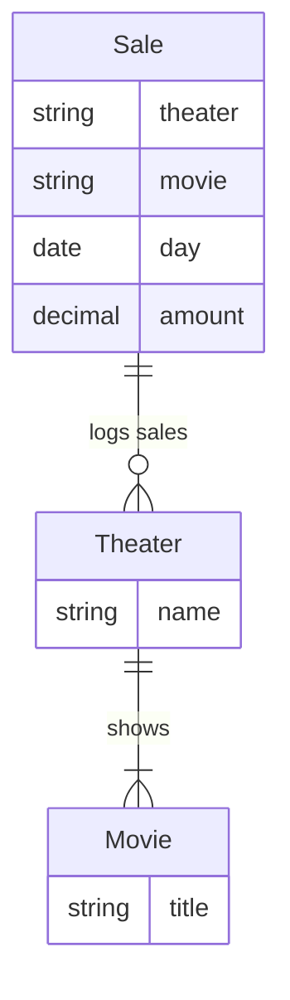

# Box Office Trend

A demo project, showcasing simple tracking of  box office trends.

## Install

## Run

Start the postgresql database:

```shell
docker-compose up
```

Seed the database. Open the URL [http://localhost:8080/?pgsql=db&username=pguser&db=pguser&ns=public&sql=](http://localhost:8080/?pgsql=db&username=pguser&db=pguser&ns=public&sql=), and paste the contents of [DDL.v.1.0.0.sql]( ./DDL.v.1.0.0.sql) into the command window and execute it.

If all went well, 3 tabels are created, and data is seeded into them.

The schema is:



With this structure, we can answer questions about how many sales, with what total daily amounts occured per movie.

## Python Demo

The interaction with the PostgreSQL database is performed directly using the driver. [/py/day_query.py](/py/day_query.py) contains the code, and exposes a method that returns the theater with the highest total sales across all movies shown for a single given day.

> The demo was developed and tested using [uv](//docs.astral.sh/uv/).

```bash
uv sync
uv run ./py/cli.py 
```

You will be prompted for a date. The date should be entered in `YYYY-MM-DD` format. Failure to enter a date in this format will re-prompt the user.

> The Postgres connection is hard coded for demo purposes. Ensure you change to a strong password for any non-demo use.

## Javascript Demo

The interaction with the PostgreSQL database is performed directly using the driver. [/js/dayQuery.js](/js/dayQuery.js) contains the code, and exposes a method that returns the theater with the highest total sales across all movies shown for a single given day.

> The demo was developed and tested using [bun](//bun.sh/).

```bash
cd js
bun install
bun run ./cli.js
```

## Troubleshooting

The dates for which data exist can be gleened from [DDL.v.1.0.0.sql](/DDL.v.1.0.0.sql):

- `2025-01-01`
- `2025-01-02`
- `2025-01-03`

## What Next?

With script in hand interacting with the database, it's easy to expose the functionality as REST api.

The code in [api/main.py](api/main.py) does just that. It uses FastAPI to serve up the route `https://localhost:8000/sales/` and enable web pages or other processes to query your database.
